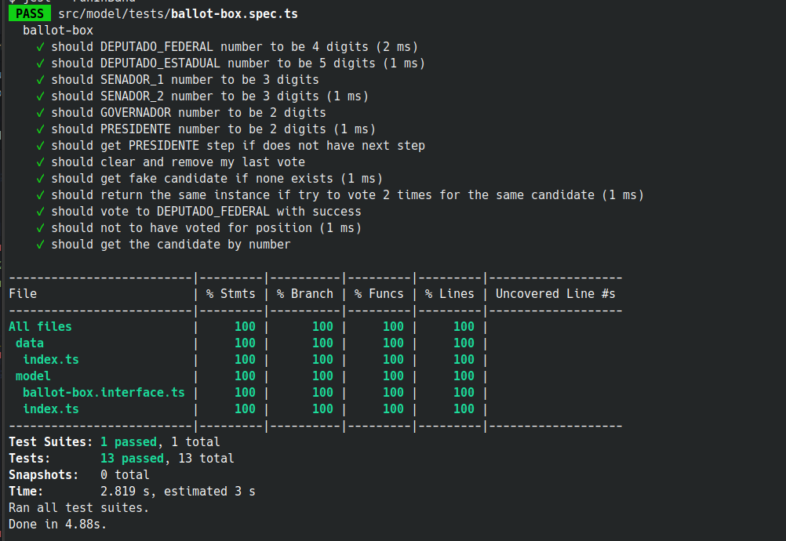
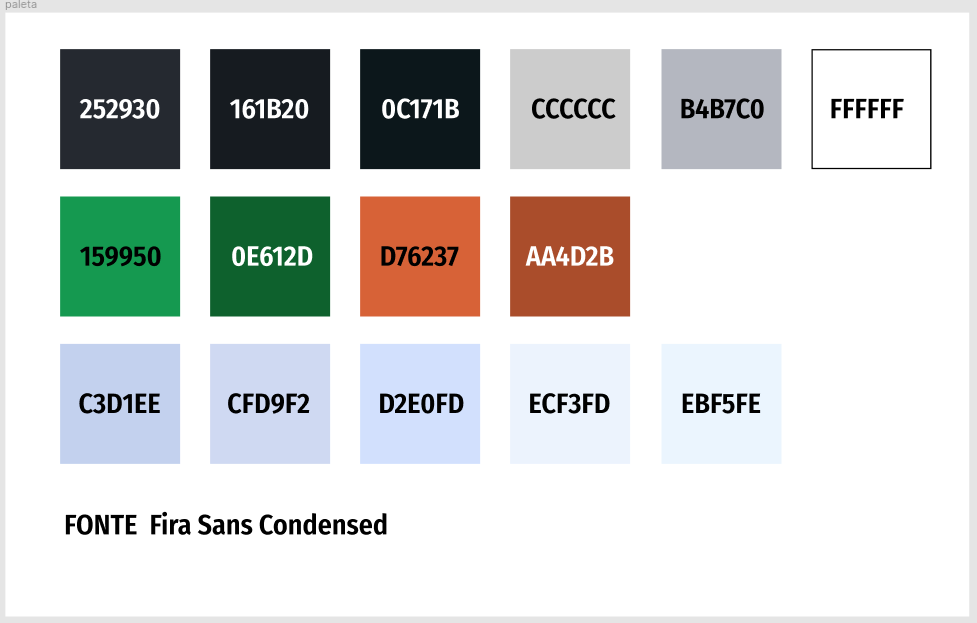
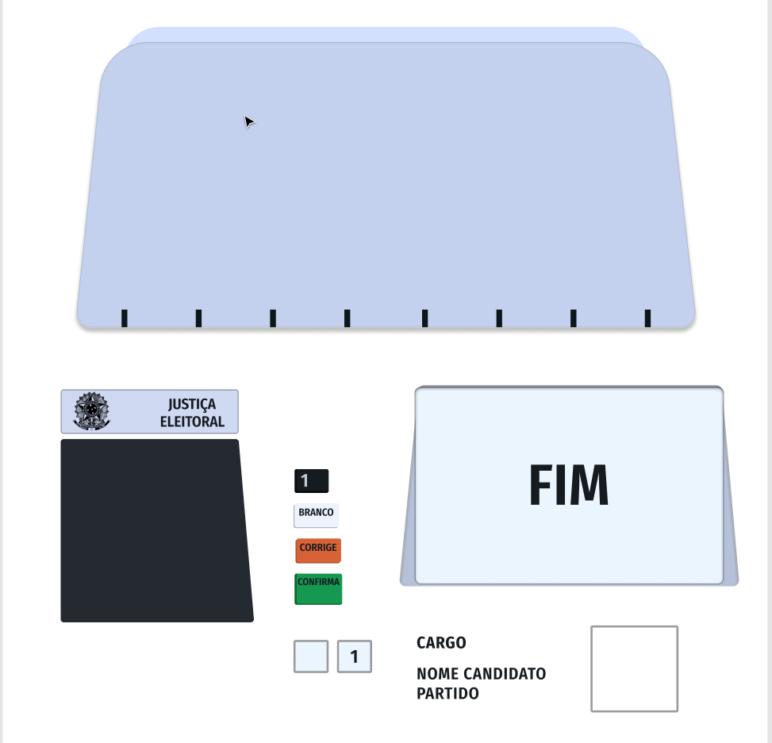
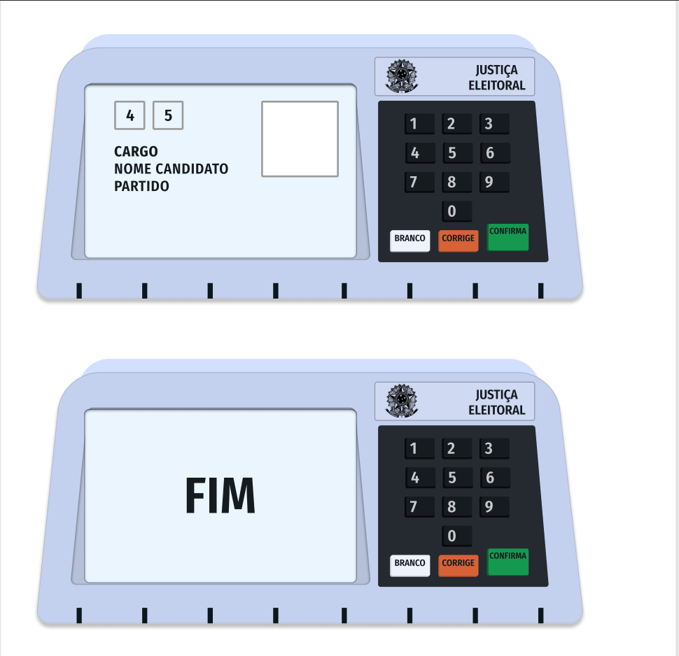

# Urna Eletrônica Brasileira

Um projetinho para simular a interface e o funcionamento da urna eletrônica brasileira.

## Regra de negócio testada e aprovada

Testes realizados para validar o fluxo de negócio.



### Primeiros passos

Primeiro, execute seu servidor

```bash
npm run dev
# or
yarn dev
```

Open [http://localhost:3000](http://localhost:3000) with your browser to see the result.






